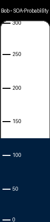

# Progress Bar Maker

A simple Python project to track and visualize study hours for exams. This project is a very simple, personal tool made to help keep me on track towards my exam goals by motivating me to fill the bar up!

## 🎨 Example Progress Bar

Here’s an example progress bar for tracking **Bob’s SOA-Probability exam**:

## ✨ Features

✅ Track progress for multiple users and exams  
✅ Add hours to existing progress easily  
✅ Generate visually appealing vertical progress bars (navy fill, white unfilled background)  
✅ Tick marks & labels adjust color for maximum readability  
✅ Save progress data in a JSON file for persistent tracking

